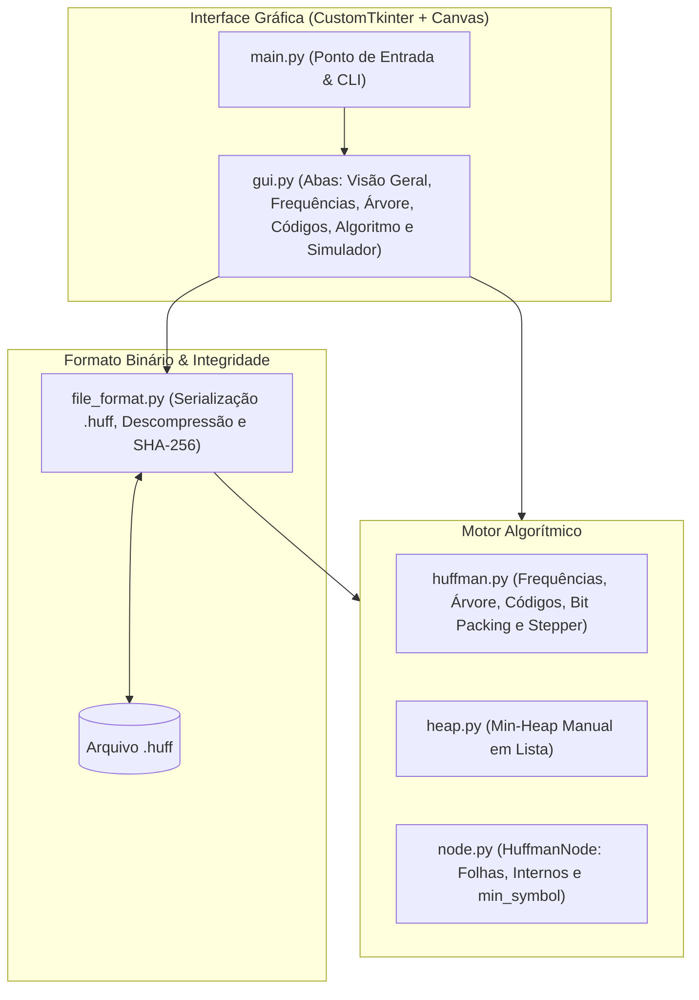

# HuffPress

Número da Lista: 33<br>
Conteúdo da Disciplina: Algoritmos Ambiciosos (Greedy) — Codificação de Huffman<br>

## Alunos

| Matrícula | Aluno |
| :-- | :-- |
| 22/1022266 | Eric Silveira Gomes |

---

## Sobre

O **HuffPress** é uma aplicação desktop didática, técnica e completa dedicada à demonstração e análise prática do **Algoritmo Ambicioso de Huffman** para compressão de arquivos sem perdas (*lossless compression*).

O objetivo central do projeto é demonstrar a elegância da estratégia ambiciosa na construção de **códigos de prefixo de comprimento variável** ótimos. O sistema analisa a frequência de cada byte (0 a 255) em qualquer arquivo de entrada, utiliza uma **Min-Heap manual** para combinar iterativamente os nós de menor ocorrência e gera uma árvore binária ótima em que símbolos frequentes recebem códigos binários curtos e símbolos raros recebem códigos mais longos.

A implementação é **100% determinística, transparente e reproduzível**, construída do zero sem o uso de bibliotecas de compressão prontas (`gzip`, `zlib`, `bz2`) ou estruturas de prioridade pré-fabricadas (`heapq`).

### Destaques do Sistema

* **Min-Heap Manual em Vetor:** Fila de prioridades com subida (*sift-up*) e descida (*sift-down*) implementadas manualmente em tempo $O(\log n)$;
* **Desempate Determinístico:** Critério de desempate estável baseado no menor símbolo da subárvore (`min_symbol`), garantindo árvores idênticas em qualquer execução;
* **Bit Packing Real:** Empacotamento bit a bit através de deslocamentos binários e máscaras lógicas, gravando bytes reais;
* **Formato Binário `.huff` Autocontido:** Cabeçalho customizado com metadados e tabela de frequências serializada, dispensando dependências externas;
* **Validação Estrita de Integridade (SHA-256):** Checksum criptográfico garantindo correspondência byte a byte na descompactação;
* **Interface Técnica Moderna:** Inspirada na clareza visual de ferramentas como Linear, Raycast e Vercel, com visualizador interativo de árvore (*Fit to View*), stepper ambicioso passo a passo e simulador didático de bits.

---

## Arquitetura Simplificada do Sistema

O projeto adota uma arquitetura modular, separando a interface da lógica algorítmica e do formato de serialização:



---

## O Algoritmo Ambicioso de Huffman

O algoritmo de Huffman constrói uma árvore binária de baixo para cima (*bottom-up*), garantindo a propriedade dos **códigos de prefixo livres** (*prefix-free codes*): nenhum código é prefixo de outro, viabilizando decodificação instantânea sem ambiguidade.

### 1. A Estratégia da Escolha Ambiciosa

A regra de decisão ambiciosa (*Greedy Choice*) é rigorosamente local:

> **"A cada etapa, selecionamos e extraímos os dois nós com as menores frequências disponíveis na Min-Heap."**

Ao unir os dois menores pesos em um novo nó pai com peso igual à soma e reinseri-lo na heap, garantimos que símbolos de baixa frequência sejam empurrados para os níveis mais profundos da árvore, enquanto os símbolos frequentes permanecem adjacentes à raiz.

### 2. Minimização do Comprimento Médio Ponderado

O algoritmo minimiza o custo total de representação da mensagem $B$:

$$B = \sum_{i=1}^{n} f_i \cdot \text{len}(c_i)$$

onde $f_i$ é a frequência do símbolo $i$ e $\text{len}(c_i)$ é o comprimento em bits do seu código de Huffman correspondente.

### 3. Estruturas de Dados Manuais

* **Min-Heap (`heap.py`):** Armazena os nós da floresta inicial. Oferece `insert` em $O(\log n)$ e `extract_min` em $O(\log n)$.
* **Nó da Árvore (`node.py`):** Cada `HuffmanNode` guarda `symbol` (byte `0..255` em folhas ou `None` em nós internos), `frequency`, referências `left` (aresta com bit `0`), `right` (aresta com bit `1`) e `min_symbol` (utilizado para desempate lexicográfico estável).

---

## Formato Binário do Arquivo .huff e Decomposição de Overhead

O arquivo gerado pelo HuffPress é totalmente independente e autocontido:

| Offset | Tamanho | Descrição |
| :--- | :--- | :--- |
| **0** | 5 bytes | Identificador mágico `b"HUFF1"` |
| **5** | 32 bytes | Hash SHA-256 do arquivo original (checksum binário) |
| **37** | 2 bytes | Comprimento do nome do arquivo original (`uint16`) |
| **39** | $N$ bytes | Nome do arquivo original codificado em UTF-8 |
| **39 + N** | 8 bytes | Tamanho original do arquivo em bytes (`uint64`) |
| **47 + N** | 8 bytes | Quantidade total de bits válidos codificados (`uint64`) |
| **55 + N** | 2 bytes | Quantidade de símbolos na tabela de frequências ($K$) |
| **57 + N** | $K \times 9$ bytes | Tabela serializada: pares `(símbolo: 1 byte, frequência: 8 bytes uint64)` |
| **Final** | Restante | **Payload comprimido** com bits empacotados |

### Explicação do Overhead em Arquivos Pequenos

Em arquivos pequenos (ex.: poucas centenas de bytes), o arquivo `.huff` resultante pode ser maior que o original. O HuffPress decompõe visualmente esse comportamento na interface:

$$\text{Tamanho Final (.huff)} = \text{Payload Codificado} + \text{Cabeçalho / Metadados}$$

* **Payload:** Bits reais comprimidos gerados pela árvore (frequentemente 30% a 50% menores que os bytes brutos);
* **Metadados:** Estrutura obrigatória para garantir descompressão independente e validação de integridade.

Quando o ganho no payload não supera o tamanho fixo dos metadados, o arquivo expande naturalmente — um comportamento padrão e matematicamente esperado em qualquer algoritmo de compressão com tabela incorporada.

---

## Interface Desktop e Recursos Visuais

A interface gráfica foi projetada para apresentações acadêmicas claras e diretas, dividida em 6 abas temáticas:

### 1. Visão Geral (Resumo & Overhead)
Apresenta imediatamente as respostas centrais da compressão: tamanho original, tamanho final, percentual de redução/acréscimo, partição exata entre Payload e Metadados, tempo de execução e seção retrátil (*collapsible*) com detalhes técnicos e hash SHA-256.

### 2. Frequências (Gráfico Alinhado)
Gráfico de barras dominante e responsivo com colunas perfeitamente alinhadas:
* Símbolo formatado (ex.: `' ' (espaço)`, `0x0A (Newline \n)`);
* Barra proporcional preenchida com trilha de fundo sutil;
* Percentual relativo do arquivo;
* Ocorrências absolutas.
* Clique em qualquer barra para inspecionar e navegar até a folha na árvore.

### 3. Árvore de Huffman Interativa (Fit to View & Caminho)
* **Ajustar à tela (*Fit to View*):** Calcula a *bounding box* geométrica da árvore e ajusta a escala ideal na viewport com margem de 8%, enquadrando a árvore inteira automaticamente;
* **Zoom & Pan:** Controles `+` e `−` (40% a 250%), suporte a scroll do mouse e arraste com o cursor;
* **Destaque de Caminho:** Ao clicar em qualquer folha (ou selecionar um símbolo em outra aba), a árvore destaca visualmente todo o percurso da raiz até a folha (`#4F46E5`, arestas espessas e nós realçados), exibindo o *breadcrumb* exato de bits:
  $$\text{raiz} \xrightarrow{\quad 1 \quad} \text{nó} \xrightarrow{\quad 0 \quad} \text{nó} \xrightarrow{\quad 0 \quad} \text{'B'}$$

### 4. Dicionário de Códigos
Tabela completa dos códigos de prefixo gerados, com linhas arejadas, símbolos legíveis e código binário exibido em fonte monoespaçada.

### 5. Algoritmo (Stepper Ambicioso da Min-Heap)
Simulador passo a passo da construção ambiciosa:
* Exibe a Min-Heap antes da etapa com os dois menores elementos destacados (`1º menor` e `2º menor`);
* Diagrama da fusão somando as duas frequências;
* Criação do novo nó interno e sua reinserção na Min-Heap resultante.

### 6. Simulador Didático ("Experimentar Huffman" & Bits)
Permite ao usuário digitar qualquer palavra curta (ex.: `BANANA`, `ABRACADABRA`) e exibe a codificação comparativa de bits em tempo real:
* **Original:** 8 bits fixos ASCII por caractere (ex.: `01000010 01000001 ...` = 48 bits);
* **Huffman:** Códigos de tamanho variável correspondentes (ex.: `110 0 10 0 ...` = 8 bits);
* Demonstração imediata da economia percentual no nível de bits.

---

## Vídeo de Apresentação

<div align="center">
  <i>(Vídeo de apresentação em processamento/upload)</i>
</div>

---

## Instalação e Execução

**Linguagem:** Python 3.10+<br>
**Interface Gráfica:** CustomTkinter + Tkinter puro<br>

### 1. Instalar Dependências

No diretório raiz do projeto:

```bash
pip install -r requirements.txt
```

### 2. Executar a Interface Desktop

```bash
python3 main.py
```

### 3. Modo Linha de Comando (Opcional)

Para compactações ou descompactações diretas pelo terminal:

```bash
# Compactar arquivo:
python3 main.py -c dados.txt

# Descompactar arquivo .huff:
python3 main.py -d dados.txt.huff
```

---

## Estrutura do Repositório

```text
.
├── file_format.py       # Serialização do formato .huff, descompressão e SHA-256
├── gui.py               # Interface gráfica moderna (CustomTkinter + Canvas interativo)
├── heap.py              # Min-Heap manual em vetor com sift-up e sift-down
├── huffman.py           # Algoritmo de Huffman, árvore, códigos e bit packing
├── main.py              # Ponto de entrada da aplicação (GUI padrão ou CLI)
├── node.py              # HuffmanNode (nós folhas, internos e desempate determinístico)
├── dados.txt            # Arquivo textual de exemplo para testes imediatos
├── requirements.txt     # Dependências da aplicação (customtkinter)
└── README.md            # Documentação técnica do projeto
```

---

## Decisões de Projeto e Refinamentos de Desenvolvimento

Durante a concepção e implementação do HuffPress, foram adotadas as seguintes diretrizes de engenharia de software e didática algorítmica:

1. **Min-Heap Manual sem Bibliotecas:** A fila de prioridades foi desenvolvida estritamente sobre listas nativas em Python, implementando os operadores de subida e descida no heap para demonstrar o custo $O(\log n)$ da decisão ambiciosa.
2. **Desempate Estável com `min_symbol`:** Em casos de frequências idênticas entre nós, o algoritmo utiliza o menor símbolo contido na respectiva subárvore para desempatar, garantindo determinismo absoluto na serialização da árvore.
3. **Bit Packing em Nível de Byte:** Os bits não são tratados como strings de texto na saída final; um buffer binário empacota blocos de 8 bits em bytes reais com registro da contagem exata de bits válidos para descarte de preenchimento (*padding*).
4. **Enquadramento Geométrico (*Fit to View*):** A visualização da árvore substitui centralizações estáticas por um cálculo dinâmico da *bounding box* dos nós contra o tamanho da janela, garantindo que a árvore completa caiba perfeitamente na viewport ao abrir ou redimensionar.
5. **Destaque Bidirecional de Caminhos:** Ao selecionar uma folha na árvore, no gráfico de frequências ou na tabela de códigos, o percurso da raiz até o nó é destacado com arestas espessas e rótulos de bits em destaque.
6. **Transparência na Explicação do Overhead:** Em vez de exibir apenas porcentagens negativas quando um arquivo pequeno expande, a aplicação decompõe visualmente o cabeçalho e explica didaticamente a razão da sobrecarga de metadados.
